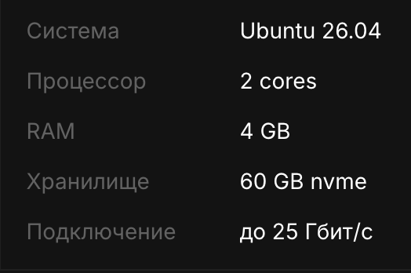
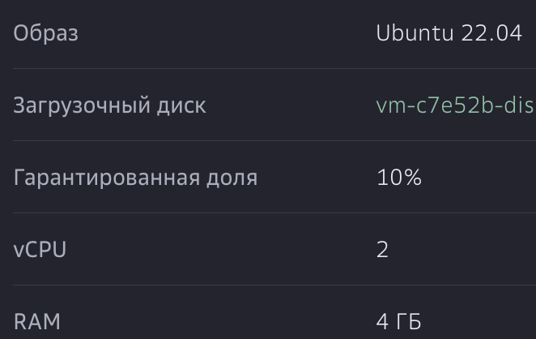
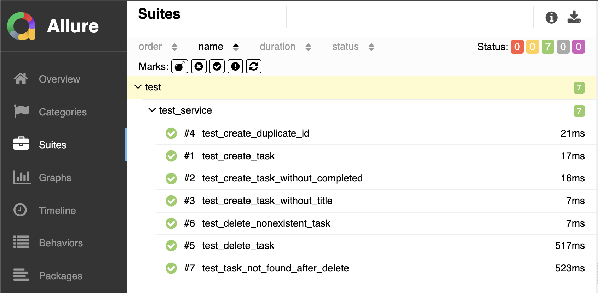
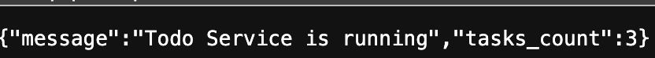

# Навигация 
* [Описание проекта](описание-проекта)
  * [Схема CI/CD](Схема-CI/CD)
* [Настройка окружения](настройка-окружения)
  * [Настройка Jenkins](настройка-Jenkins)
  * [Установка и настройка Kubernetes](установка-и-настройка-kubernetes)
* [Содержимое проекта](содержимое-проекта)
* [Работающий сервис](Работающий-сервис)


## Описание проекта
В данном репозитории расположены инструкция и исходные файлы развертывания инфраструктуры для деплоя python-приложения в kubernetes cluster посредством Jenkins/Groovy.
Инстанс Jenkins разворачивается на отдельной ВМ. Kubernetes так же разворачивался на отдельной ВМ.

## Схема CI/CD


# Настройка окружения
Ксластер kubenetes настраивался  на ВМ, которая была развернута в облаке Aeza.
Характеристики ВМ:


```
Версия Docker 29.3.1, build c2be9cc
```

## Настройка Jenkins
Ксластер Jenkins  разварачивался на ВМ, которая была развернута в облаке Cloud.ru.
Характеристики ВМ:


- Установим java
```
sudo apt update
sudo apt install -y openjdk-17-jre
```

- Установка Jenkins
- Добавим ключ репозитория
```
curl -fsSL https://pkg.jenkins.io/debian-stable/jenkins.io-2023.key | sudo tee /usr/share/keyrings/jenkins-keyring.asc > /dev/null
```

- Добавим репозиторий в список apt
```
echo deb [signed-by=/usr/share/keyrings/jenkins-keyring.asc] https://pkg.jenkins.io/debian-stable binary/ | sudo tee /etc/apt/sources.list.d/jenkins.list > /dev/null
```

- Обновим список пакетов и установим Jenkins
```
sudo apt-get update
sudo apt-get install -y jenkins
```

Проверка запущенной службы Jenkins
```
sudo systemctl status jenkins
```

Получение первоначального пароля
```
sudo cat /var/lib/jenkins/secrets/initialAdminPassword
```

Дополнительно установленные плагины, которые использовались в работе
```
- Pipeline
- Allure 
- Pipeline Stage View Plugin
- Rebuilder
```

## Установка и настройка Kubernetes
Ксластер kubenetes настраивался  на ВМ, которая была развернута в облаке Aeza.
Характеристики ВМ:


- Отлючим swap
```
sudo swapoff -a
```

- Подгружаем необходимые модули ядра
```
cat <<EOF | sudo tee /etc/modules-load.d/containerd.conf
overlay
br_netfilter
EOF

sudo modprobe overlay
sudo modprobe br_netfilter

- Настраиваем сетевые параметры sysctl
cat <<EOF | sudo tee /etc/sysctl.d/99-kubernetes-cri.conf
net.bridge.bridge-nf-call-iptables  = 1
net.ipv4.ip_forward                 = 1
net.bridge.bridge-nf-call-ip6tables = 1
EOF

sudo sysctl --system
```

- Устанавливаем containerd (CRI)
```
sudo apt-get update
sudo apt-get install -y containerd
```

- Создаем конфиг по умолчанию и перезапускаем containerd с SystemdCgroup
```
sudo mkdir -p /etc/containerd
containerd config default | sudo tee /etc/containerd/config.toml
sudo sed -i 's/SystemdCgroup = false/SystemdCgroup = true/' /etc/containerd/config.toml
sudo systemctl restart containerd
```

- Устанавливаем зависимости
```
sudo apt-get update
sudo apt-get install -y apt-transport-https ca-certificates curl gpg
```

- Скачиваем дистрибутив и добавляем ключ в репозиторий
```
curl -fsSL https://pkgs.k8s.io/core:/stable:/v1.33/deb/Release.key | sudo gpg --dearmor -o /etc/apt/keyrings/kubernetes-apt-keyring.gpg
echo 'deb [signed-by=/etc/apt/keyrings/kubernetes-apt-keyring.gpg] https://pkgs.k8s.io/core:/stable:/v1.33/deb/ /' | sudo tee /etc/apt/sources.list.d/kubernetes.list
```

- Происховдим установку пакетов
sudo apt-get update
sudo apt-get install -y kubelet kubeadm kubectl

- Инициализация Control Plane
```
sudo kubeadm init --pod-network-cidr=192.168.0.0/16 --apiserver-advertise-address=<...>
mkdir -p $HOME/.kube
sudo cp -i /etc/kubernetes/admin.conf $HOME/.kube/config
sudo chown $(id -u):$(id -g) $HOME/.kube/config
```

- Проверяем, установлен ли Tigera
```
kubectl get pods -n tigera-operator
```

- Так как запущенного пода нет, то делаем
```
kubectl create -f https://raw.githubusercontent.com/projectcalico/calico/v3.31.3/manifests/tigera-operator.yaml
```

- Скачиваем Calico
```
wget https://raw.githubusercontent.com/projectcalico/calico/v3.31.3/manifests/custom-resources.yaml
```

- Редактируем файл custom-resources для calico
```
kubectl create -f https://raw.githubusercontent.com/projectcalico/calico/v3.31.3/manifests/custom-resources.yaml
```

- Редактируем файл custom-resources.yaml, указывая там подсеть нашего хоста и приминяем изменения
```
kubectl apply -f custom-resources.yaml
```

- Проверяем, что под запущен
```
watch kubectl get pods -n calico-system
```

- Снятие Taint, так как у нас 1 ВМ и все будет устанавливаться на Master Node
```
kubectl taint nodes --all node-role.kubernetes.io/control-plane-
```

- Выполняем проверку
```
kubectl get nodes
```

- Создаем namespace
```
kubectl create namespace sunchipspace
```

- Создаем namespace.yaml и редактируем его
```
apiVersion: v1
kind: Namespace
metadata:
  name: sunchipspace
```
- Приминяем и проверяем
```
kubectl apply -f namespace.yaml
kubectl get namespaces
```

# Содержимое проекта
Исходный код приложения MyToDoService - https://github.com/HappilyStreet/MyToDoService 

Сущности Kubernetes, для последующего разворачивания образа приложения в кластере
[deployment.yaml](https://github.com/HappilyStreet/MyToDoService/blob/main/helm/templates/deployment.yaml)
```
apiVersion: apps/v1
kind: Deployment
metadata:
  name: {{ .Values.app }}-deployment
  namespace: sunchipspace
  labels:
    app: {{ .Values.app }}-k8s
spec:
  replicas: 2
  selector:
    matchLabels:
      project: {{ .Values.app }}
  template:
    metadata:
      labels:
        project: {{ .Values.app }}
      annotations:
        prometheus.io/scrape: "true"
        prometheus.io/port: "80"
        prometheus.io/path: "/metrics"
    spec:
      containers:
        - name: {{ .Values.app }}-web
          image: {{ .Values.image.repository }}:{{ .Values.image.tag }}
          imagePullPolicy: Always
          ports:
          - containerPort: 80
          resources:
            requests:
              cpu: "100m"
              memory: "128Mi"
            limits:
              cpu: "200m"
              memory: "128Mi"
          livenessProbe:
            httpGet:
              path: /health
              port: 80
            initialDelaySeconds: 10
            periodSeconds: 10
          readinessProbe:
            httpGet:
              path: /health
              port: 80
            initialDelaySeconds: 5
            periodSeconds: 5
```
[hpa.yaml](https://github.com/HappilyStreet/MyToDoService/blob/main/helm/templates/hpa.yaml)
```
apiVersion: autoscaling/v2
kind: HorizontalPodAutoscaler
metadata:
  name: {{ .Values.app }}-hpa
  namespace: sunchipspace
  labels:
    app: {{ .Values.app }}-k8s
spec:
  scaleTargetRef:
    apiVersion: apps/v1
    kind: Deployment
    name: {{ .Values.app }}-deployment
  minReplicas: 2
  maxReplicas: 5
  metrics:
    - type: Resource
      resource:
        name: cpu
        target:
          type: Utilization
          averageUtilization: 75
```
[service.yaml] (https://github.com/HappilyStreet/MyToDoService/blob/main/helm/templates/service.yaml)
```
apiVersion: v1
kind: Service
metadata:
  name: {{ .Values.app }}-service
  namespace: sunchipspace
  labels:
    env: PROD
spec:
  selector:
    project: {{ .Values.app }}
  ports:
    - name: {{ .Values.app }}-listener
      protocol: TCP
      port: 80
      targetPort: 80
      nodePort: {{ .Values.servicePort}}
  type: {{ .Values.nodetype }}
```

Код pipelin-a [Jenkinsfile](https://github.com/HappilyStreet/jenkins-pipeline/blob/main/jenkinsfile)
```
pipeline {
    agent any
    environment {
        serviceDir = '../app'  // путь к клонированному репозиторию с микросервисом
        imageTag = "${env.BUILD_NUMBER}"  // общий тег для всех стадий
        BRANCH = "${params.BRANCH_NAME ?: env.BRANCH_NAME ?: 'main'}".replaceFirst('refs/heads/', '')
    }
    stages {
        stage('Init envs') {
            steps {
                withVault(
                    configuration: [
                        vaultCredentialId: 'myapprole'
                    ],
                    vaultSecrets: [
                        [
                            path: 'kv/gitlab',
                            engineVersion: 2,
                            secretValues: [
                                [envVar: 'DOCKER_TOKEN', vaultKey: 'docker_token'],
                                [envVar: 'DOCKER_USER', vaultKey: 'docker_user'],
                                [envVar: 'KUBECONFIG', vaultKey: 'kube_config']
                            ]
                        ]
                    ]

                ) {
                    script{
                        String dockerToken = env.DOCKER_TOKEN
                        byte[] decodedToken = java.util.Base64.getDecoder().decode(dockerToken)
                        String decoded_token = new String(decodedToken, 'UTF-8')
                        env.DOCKER_SECRET = decoded_token

                        String kubeСonfig = env.KUBECONFIG
                        byte[] decodedConfig = java.util.Base64.getDecoder().decode(kubeСonfig)
                        String decoded_config = new String(decodedConfig, 'UTF-8')
                        writeFile file: 'kubeconfig.yaml', text: decoded_config
                        env.KUBE_CONFIG_PATH = pwd() + '/kubeconfig.yaml'

                        env.USER_DOCKER = env.DOCKER_USER
                        print(USER_DOCKER)
                        echo "DOCKER_USER length: ${env.DOCKER_USER?.length() ?: 0}"
                        echo "✅ Docker user: ${env.DOCKER_USER}"
                        // env.KUBE_SECRET = decoded_config
                    }
                }
                script {

                    env.BRANCH = (params.BRANCH_NAME ?: env.BRANCH_NAME ?: 'main').replaceFirst('refs/heads/', '')
                    echo "Detected branch: ${env.BRANCH}"
                }
            }
        }
        stage('Packages and Tests') {
            when {
                expression {
                    (env.BRANCH == 'main') && (!params.INSTALL) && (!params.DELETE)
                }
            }
            steps {
                script{
                    def packagesScript = load 'vars/packages.groovy'
                    packagesScript.packagesStage()
                }
            }
        }
        stage('Build and push') {
            when {
                expression { 
                   (env.BRANCH == 'main') && (!params.INSTALL) && (!params.DELETE)
                }
            }
            steps {
                script {
                    def buildScript = load 'vars/build.groovy'
                    buildScript.buildStage()
                }
            }
        }
        stage('Deploy') {
            when {
                    expression { 
                        ((env.BRANCH == 'main') || (params.INSTALL)) && (!params.DELETE)
                    }
            }
            steps {
                script {
                    def deployScript = load 'vars/deploy.groovy'
                    deployScript.deployStage()
                }
            }
        }
        stage('Run tests after deploy') {
            when {
                    expression { 
                        ((env.BRANCH == 'main') || (params.INSTALL)) && (!params.DELETE)
                }
            }
            steps {
                script {
                    def testsScript = load 'vars/tests.groovy'
                    testsScript.testStage()
                }
            }
        }
        stage('Delete service') {
            when {
                expression { (params.DELETE) }
            }
            steps {
                script {
                    def deleteScript = load 'vars/delete.groovy'
                    deleteScript.deleteStage()
                }
            }
        }
        stage('Cleanup') {
            steps {
                sh 'rm -f kubeconfig.yaml'
            }
        }
    }
    post {
        always {
            cleanWs()
        }
    }
}
```
Stage Init envs [Jenkinsfile](https://github.com/HappilyStreet/jenkins-pipeline/blob/main/jenkinsfile)
```
            steps {
                withVault(
                    configuration: [
                        vaultCredentialId: 'myapprole'
                    ],
                    vaultSecrets: [
                        [
                            path: 'kv/gitlab',
                            engineVersion: 2,
                            secretValues: [
                                [envVar: 'DOCKER_TOKEN', vaultKey: 'docker_token'],
                                [envVar: 'DOCKER_USER', vaultKey: 'docker_user'],
                                [envVar: 'KUBECONFIG', vaultKey: 'kube_config']
                            ]
                        ]
                    ]

                ) {
                    script{
                        String dockerToken = env.DOCKER_TOKEN
                        byte[] decodedToken = java.util.Base64.getDecoder().decode(dockerToken)
                        String decoded_token = new String(decodedToken, 'UTF-8')
                        env.DOCKER_SECRET = decoded_token

                        String kubeСonfig = env.KUBECONFIG
                        byte[] decodedConfig = java.util.Base64.getDecoder().decode(kubeСonfig)
                        String decoded_config = new String(decodedConfig, 'UTF-8')
                        writeFile file: 'kubeconfig.yaml', text: decoded_config
                        env.KUBE_CONFIG_PATH = pwd() + '/kubeconfig.yaml'

                        env.USER_DOCKER = env.DOCKER_USER
                        print(USER_DOCKER)
                        echo "DOCKER_USER length: ${env.DOCKER_USER?.length() ?: 0}"
                        echo "✅ Docker user: ${env.DOCKER_USER}"
                        // env.KUBE_SECRET = decoded_config
                    }
                }
                script {

                    env.BRANCH = (params.BRANCH_NAME ?: env.BRANCH_NAME ?: 'main').replaceFirst('refs/heads/', '')
                    echo "Detected branch: ${env.BRANCH}"
                }
            }
        }
```
Script Packages and Tests [vars/packages.groovy](https://github.com/HappilyStreet/jenkins-pipeline/blob/main/vars/packages.groovy)
```
def packagesStage() {
    echo "🔹 Starting Pakage Stage"
    echo "Cloning repo"

    withEnv(["PATH=/usr/local/bin:$PATH"]) {
        dir(serviceDir) {
            if(fileExists(".git")) {
                echo "✅ Repo exists, pulling latest changes"

                sh "git reset --hard && git clean -fd"
                sh "git pull origin main"
            }
            else {
                echo "🔹Repo didnt exist and will be clone"
                sh "git clone https://github.com/HappilyStreet/MyToDoService.git ."
            }

            echo "Check and install dependensies"


            // Создаем виртуальное окружение и ставим только нужные пакеты для линтера
            sh '''
                python3 -m venv venv
                . venv/bin/activate
                pip install --upgrade pip
                pylint **/*.py || true
            '''

            // allure([
            //     includeProperties: false,
            //     jdk: '',
            //     results: [[path: 'allure-results']]
            // ])
        }
    }
    echo "✅ Checkout complete and tests complete"
}
return this
```
Script Build and push [vars/build.groovy](https://github.com/HappilyStreet/jenkins-pipeline/blob/main/vars/build.groovy)
```
def buildStage() {
    dir(serviceDir) {
        withEnv(["PATH=/usr/local/bin:$PATH"]) {
            echo "Logging in to Docker Registry..."
            echo "${env.DOCKER_SECRET} "
            echo "${env.USER_DOCKER}"
            sh "echo ${env.DOCKER_SECRET} | docker login -u ${env.USER_DOCKER} --password-stdin"

            echo "Building Docker image with tag: mytodo-service:${imageTag}"
            sh "docker build -t mytodo-service:${imageTag} ${serviceDir}"   

            echo "Pushing Docker image to registry..."
            sh "docker tag mytodo-service:${imageTag} mrsunchip/mytodo-service:${imageTag}"
            sh "docker push mrsunchip/mytodo-service:${imageTag}"  

        }

    }
    echo "✅  Builded and pushed to docker hub"
}
return this
```
Script Deploy [vars/deploy.groovy](https://github.com/HappilyStreet/jenkins-pipeline/blob/main/vars/deploy.groovy)
```
def deployStage(){
    withEnv(["PATH=${env.HOME}/bin:${env.PATH}"]) {
        echo "🔹 BUILD=install → fetching latest image tag from Docker Hub"
        def repo = 'mrsunchip/mytodo-service'

        def response = sh (
            script: "curl -s 'https://hub.docker.com/v2/repositories/${repo}/tags?page_size=1&ordering=last_updated'",
            returnStdout: true
        ).trim()
    
        def json = readJSON (text: response)
        imageTag = json.results[0].name

        echo "✅ Latest image tag from Docker Hub: ${imageTag}"

        // echo "KUBECONFIG path is: ${env.KUBECONFIG}"
        sh "kubectl get nodes --kubeconfig ${env.KUBE_CONFIG_PATH}"
        dir(serviceDir){
            sh "pwd"
            sh "ls -l ./helm"
            echo "Deploying to Kubernetes using Helm..."
            sh "helm upgrade --install mytodo ./helm --set image.tag=${imageTag} --kubeconfig ${env.KUBE_CONFIG_PATH}"
        }
    }
echo "✅ Deploy Stage completed."
}
return this
```
Script Run tests after deploy [vars/tests.groovy](https://github.com/HappilyStreet/jenkins-pipeline/blob/main/vars/tests.groovy)
```
def testStage() {
    echo "🔹 Running tests after deploy"

    dir(serviceDir) {
        sh '''
            pwd
            python3 -m venv venv
            venv/bin/pip install -r requirements.txt
            venv/bin/pytest test/test_service.py --alluredir=allure-results
        '''

        allure([
            includeProperties: false,
            jdk: '',
            results: [[path: 'allure-results']]
        ])
    }
}
return this
```
Результаты тестов в allure reports


# Работающий сервис



